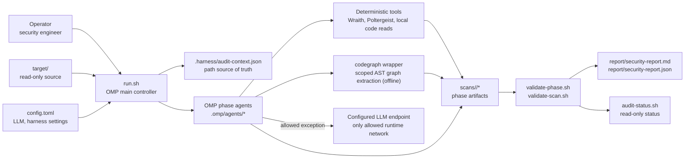
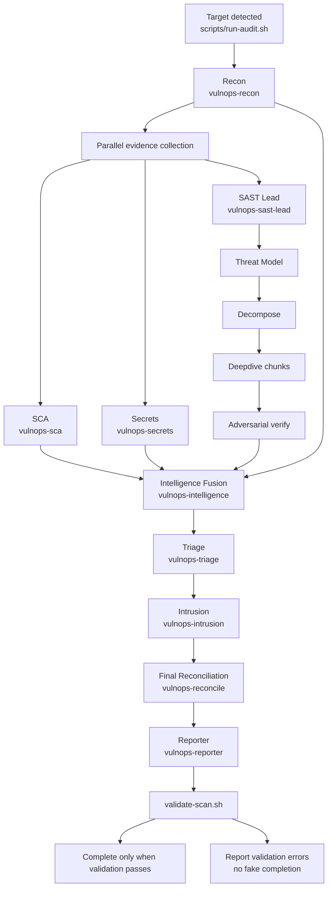
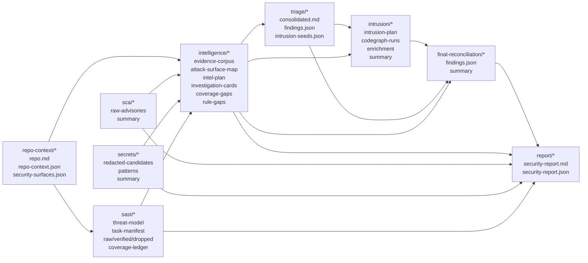
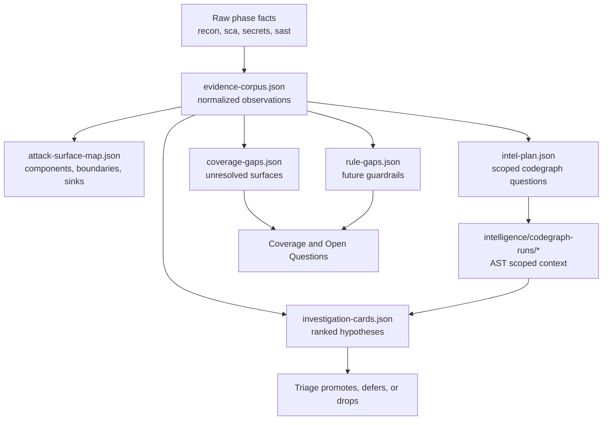
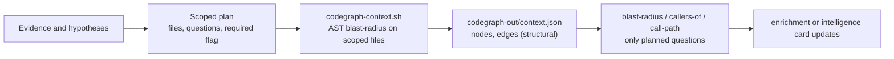
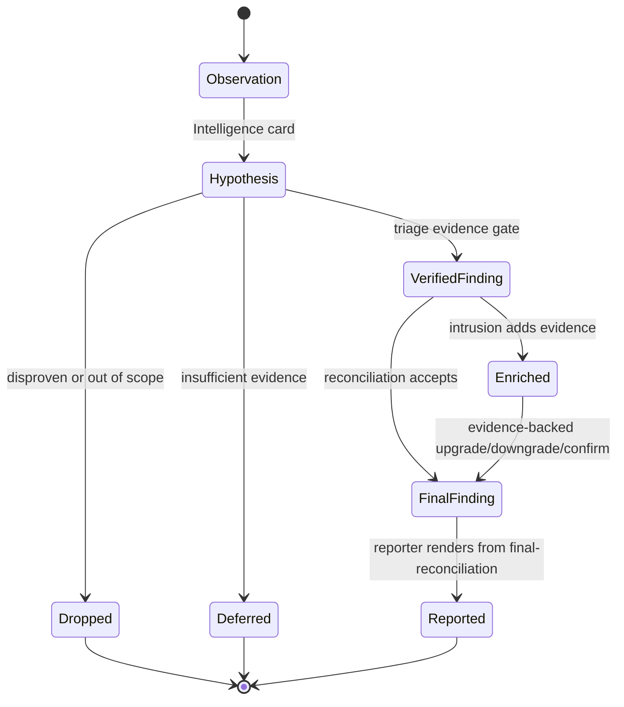
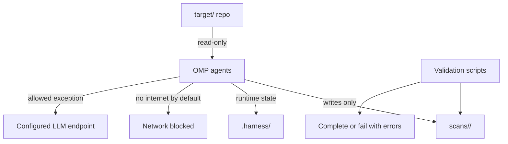

# VulnOps Harness Architecture

## Executive View

VulnOps is a read-only security audit harness for source repositories placed under `target/`. The harness uses OMP as the audit controller, runs specialized phase agents, captures every phase as filesystem artifacts under `scans/`, and validates the scan before any report is treated as complete.

The architecture is an OODA value chain:

- **Observe:** map the repository and collect deterministic evidence from dependency, secrets, and code-analysis tools.
- **Orient:** fuse collected evidence into intelligence cards, graph scopes, coverage gaps, and rule gaps.
- **Decide:** triage only evidence-backed candidates into verified findings, deferred hypotheses, or drops.
- **Act:** run scoped codegraph AST analysis for high-value reachability, blast-radius, dependency-impact, and cross-boundary questions, then reconcile and report.

The core promise is simple: **preserve intelligence across phases without allowing hypotheses to become findings unless they pass evidence gates**. The harness should make it easy to push hard on suspicious attack paths, but difficult to publish speculation.

## System Context

The target repository is never modified. Runtime homes, caches, logs, temporary files, and generated provider files are kept under `.harness/` or other harness-approved paths. Audit runtime is offline except for the configured LLM endpoint used by OMP. codegraph is AST-only and makes no network calls.

## OODA Workflow

## Artifact Data Flow

The artifact graph is intentionally redundant. The final report is not allowed to be the only place where meaning exists. Each phase leaves a machine-readable trail so validation, recovery, and future audits can reconstruct why a finding survived or died.

## Value Chain By Phase

| Phase | Input value consumed | New value produced | Downstream consumers | Validation gate | Failure behavior |
|---|---|---|---|---|---|
| Target detection | `target/` repository, `config.toml`, installed tools | `.harness/audit-context.json`, scan directories, canonical paths | Main controller, all agents | tool/config checks plus path containment | Stop before phase work |
| Recon | Source tree, build files, config files, architecture clues | `repo.md`, `repo-context.json`, `security-surfaces.json`, recon manifest | SAST, Intelligence, Intrusion, Report | `validate-phase.sh recon` | Stop; no downstream phase has a trustworthy map |
| SCA | Recon context, dependency manifests, local OSV data through Wraith | `raw-advisories.json`, lockfile inventory, SCA summary | Intelligence, Triage, Report | `validate-phase.sh sca` | Stop or surface missing/incomplete advisory evidence |
| Secrets | Source tree, recon context, Poltergeist output | `redacted-candidates.json`, systemic secret patterns, secrets summary | Intelligence, Triage, Report | `validate-phase.sh secrets` | Stop or surface redaction/scan artifact failure |
| SAST threat model | Recon map, security surfaces | Assets, entry points, trust boundaries, threats | SAST decompose | `validate-phase.sh sast-threatmodel` | Stop SAST before blind chunking |
| SAST decompose | Threat model, repo context, scan criteria | Risk-ranked chunks with files, hypotheses, lenses | Deepdive workers | `validate-phase.sh sast-decompose` | Stop SAST before broad analysis |
| SAST deepdive | One task chunk per worker | Raw candidate findings with evidence refs | Verifiers | `validate-phase.sh sast-deepdive` | SAST cannot promote candidates |
| SAST verify | Raw candidates, source/sink evidence, exclusion rules | `verified-findings.json`, `dropped-findings.json` | Intelligence, Triage | `validate-phase.sh sast-verify` and `validate-phase.sh sast` | Raw findings remain non-final |
| Intelligence Fusion | Recon, SCA, Secrets, SAST verified/dropped/coverage data | Evidence corpus, attack map, intelligence plan, investigation cards, coverage gaps, rule gaps | Triage, Intrusion, Reconcile, Report | `validate-phase.sh intelligence` | Stop before triage; intelligence preservation is required |
| Triage | Intelligence cards, SCA, Secrets, SAST verified findings | Consolidated verified findings, deferred/dropped hypotheses, intrusion seeds | Intrusion, Reconcile | `validate-phase.sh triage` | Stop before intrusion; no verified decision layer |
| Intrusion | Triage seeds, intelligence context, recon surfaces | Scoped codegraph context, enrichment, reachability/blast-radius/dependency-impact context | Reconcile, Report | `validate-phase.sh intrusion` | Fail closed; no missing-graph success |
| Reconciliation | Triage findings, intrusion enrichment, intelligence provenance | Final normalized findings | Reporter | `validate-phase.sh final-reconciliation` | Stop before report; no source of truth |
| Report | Final findings, scan summaries, intelligence gaps | Human report and JSON report | Operator, stakeholders, status checks | `validate-phase.sh report`, then `validate-scan.sh` | Present validation errors instead of completion |

## Intelligence Preservation Model

Intelligence Fusion is the harness memory layer between raw tool evidence and decision-making.

An intelligence card is not a finding. It may come from tool evidence, graph inference, agent exploration, or a coverage gap. Triage can promote it only after re-reading source evidence and recording closure rationale. Otherwise it remains deferred or dropped with provenance.

This prevents two bad outcomes:

- **Compression loss:** useful context disappears because it did not fit into a final finding row.
- **Speculation leakage:** an interesting hypothesis is published as a verified vulnerability.

## codegraph Scoping Model

codegraph is an AST reasoning aid, not a replacement for deterministic evidence and not an LLM. It is always scoped: `build-intelligence.py` and `build-intrusion-plan.py` emit one `codegraph-runs/<scope_id>/codegraph-out/context.json` per planned scope by invoking `scripts/codegraph-context.sh` blast-radius on the first files of each scope. There is no full-repository mode and no LLM extraction step.

Required scopes for high-impact intelligence or intrusion work must produce a non-empty `context.json` (nodes + edges > 0). If a required scope has no parseable code, the phase fails rather than publishing graph-shaped but empty output.

## Finding Lifecycle

The report is not the lifecycle authority. `final-reconciliation/findings.json` is the source of truth for reportable verified findings. Markdown is presentation. JSON controls counts, severities, statuses, and references.

## Safety And Assurance Model

Safety constraints:

- The target repository is read-only.
- Scan artifacts are written under `scans/`.
- Runtime homes, caches, temporary files, logs, and generated OMP provider files stay harness-local.
- Audit runtime is offline except for the configured LLM endpoint.
- Secret material is redacted before downstream use.
- Runtime PoC execution and exploit payloads are not part of the default architecture.
- OMP main uses phase yield and IRC progress, not bash polling loops.
- Child transcripts are not inspected with URI-style pseudo paths; filesystem artifacts are the source of truth.

Assurance gates:

| Gate | Purpose | Enforced by |
|---|---|---|
| Runtime readiness | Tools, config, containment, codegraph readiness | `scripts/validate-config.sh` |
| Phase checkpoint | Required artifacts and phase-specific invariants | `scripts/validate-phase.sh` |
| Whole-scan integrity | Cross-phase provenance, counts, stale marker rejection, graph evidence | `scripts/validate-scan.sh` |
| Status answer | Read-only current scan state without restarting work | `scripts/audit-status.sh` |

## Capability Map

| Capability | How it works | Evidence produced |
|---|---|---|
| Repository cartography | Recon maps projects, entry points, trust boundaries, sensitive data, generated ignores | `repo-context/*` |
| Dependency exposure | Wraith plus local OSV database scans lockfiles and retains advisories | `sca/raw-advisories.json` |
| Secret detection | Poltergeist or fallback pattern detection with redacted downstream candidates | `secrets/redacted-candidates.json` |
| AI-guided SAST | Threat model, risk decomposition, bounded deepdive fanout, adversarial verification | `sast/*` |
| Evidence fusion | Deterministic builder plus Intelligence agent preserve cross-tool context | `intelligence/*` |
| Scoped graph reasoning | codegraph extracts small evidence-derived AST scopes offline (no LLM) | `intelligence/codegraph-runs/*`, `intrusion/codegraph-runs/*` |
| Triage and deduplication | Verified candidates are consolidated and ranked; false positives are closed with rationale | `triage/findings.json` |
| Intrusion enrichment | Reachability, blast radius, dependency impact, and cross-boundary graph questions | `intrusion/enrichment.json` |
| Final reconciliation | Applies only evidence-backed changes to verified findings | `final-reconciliation/findings.json` |
| Reporting | Human and machine-readable report from final findings plus open intelligence context | `report/security-report.*` |

## Builder Appendix

### Source Of Truth Files

| Concern | Files |
|---|---|
| Orchestration contract | `.omp/main/vulnops-main.md`, `AGENTS.md` |
| Agent definitions | `.omp/agents/vulnops-*.md` |
| Agent behavior prompts | `config/agents/*.md` |
| Path setup and audit context | `scripts/run-audit.sh` |
| Runtime containment | `scripts/harness-lib.sh`, `scripts/jail.sh` |
| Config parsing | `scripts/parse-config.py`, `scripts/load-config.sh` |
| Intelligence planning | `scripts/build-intelligence.py` |
| Intrusion planning/finalization | `scripts/build-intrusion-plan.py`, `scripts/finalize-intrusion.py` |
| codegraph execution | `scripts/run-codegraph.sh`, `scripts/codegraph-context.sh` |
| Validation | `scripts/validate-config.sh`, `scripts/validate-phase.sh`, `scripts/validate-scan.sh` |
| Operator status | `scripts/audit-status.sh` |

### Required Artifact Contract

| Phase | Required artifacts |
|---|---|
| Recon | `repo-context/repo.md`, `repo-context/repo-context.json`, `repo-context/security-surfaces.json`, `repo-context/phase-manifest.json` |
| SCA | `sca/summary.md`, `sca/raw-advisories.json`, `sca/phase-manifest.json` |
| Secrets | `secrets/summary.md`, `secrets/redacted-candidates.json`, `secrets/phase-manifest.json` |
| SAST | `sast/threat-model.json`, `sast/task-manifest.json`, `sast/raw-findings.json`, `sast/verified-findings.json`, `sast/dropped-findings.json`, `sast/coverage-ledger.json`, `sast/summary.md`, `sast/phase-manifest.json` |
| Intelligence | `intelligence/evidence-corpus.json`, `intelligence/attack-surface-map.json`, `intelligence/intel-plan.json`, `intelligence/investigation-cards.json`, `intelligence/coverage-gaps.json`, `intelligence/rule-gaps.json`, `intelligence/summary.md`, `intelligence/phase-manifest.json` |
| Triage | `triage/consolidated.md`, `triage/findings.json`, `triage/intrusion-seeds.json`, `triage/phase-manifest.json` |
| Intrusion | `intrusion/summary.md`, `intrusion/enrichment.json`, `intrusion/intrusion-plan.json`, required `intrusion/codegraph-runs/*/codegraph-out/context.json`, `intrusion/phase-manifest.json` |
| Final Reconciliation | `final-reconciliation/findings.json`, `final-reconciliation/summary.md`, `final-reconciliation/phase-manifest.json` |
| Report | `report/security-report.md`, `report/security-report.json`, `report/phase-manifest.json` |

### Consistency Checklist For Workflow Changes

When adding or changing a phase, update all of these in the same pass:

1. Add paths in `scripts/run-audit.sh`.
2. Add or update `.omp/agents/<phase>.md`.
3. Add or update `config/agents/<phase>.md`.
4. Add the phase to `.omp/main/vulnops-main.md` and `AGENTS.md`.
5. Add phase validation in `scripts/validate-phase.sh`.
6. Add cross-phase integrity checks in `scripts/validate-scan.sh`.
7. Add status visibility in `scripts/audit-status.sh` if it is a top-level phase.
8. Add readiness checks in `scripts/validate-config.sh`.
9. Update `README.md` and this architecture document.
10. Run syntax/config checks and a representative audit or recovery validation.

### Current Scan Caveat

Existing scans created before the codegraph-only architecture may fail the newer gates. That is expected. Regenerate Intelligence codegraph scopes, Intrusion codegraph scopes, final reconciliation, and report artifacts before treating those scans as complete under this architecture.

Validation failure is the right signal here. It prevents stale reports from looking current and prevents graph or intelligence gaps from being papered over by old phase manifests.

