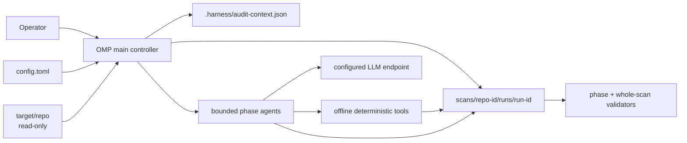
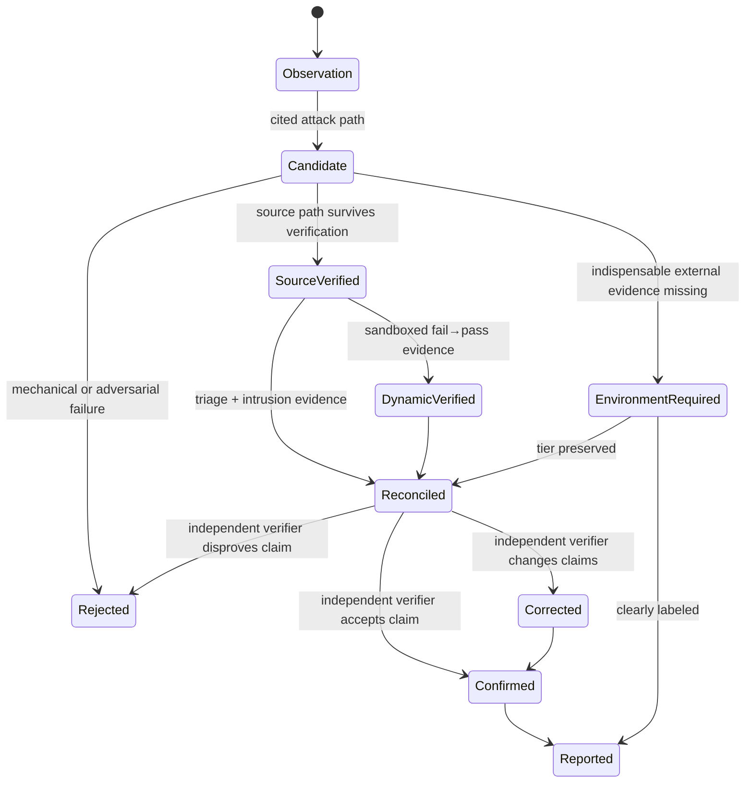

# VulnOps v2 Architecture

VulnOps is a read-only, evidence-driven repository security audit harness. It
combines deterministic tools, bounded specialist agents, strict artifact
contracts, scoped AST graph reasoning, optional safe reproduction, independent
final verification, and deterministic reporting.

Its central rule is: preserve hypotheses and coverage gaps, but publish only
claims that survive the required evidence gates.

## Containment and run isolation

```mermaid
flowchart LR
    Operator --> Main["OMP main controller"]
    Config["config.toml"] --> Main
    Target["target/repo\nread-only"] --> Main
    Main --> Context[".harness/audit-context.json"]
    Main --> Run["scans/repo-id/runs/run-id"]
    Main --> Agents["bounded phase agents"]
    Agents --> Tools["offline deterministic tools"]
    Agents --> LLM["configured LLM endpoint"]
    Tools --> Run
    Agents --> Run
    Run --> Gates["phase + whole-scan validators"]
```

Each run records the repository, commit, depth, configured model, exact target
fingerprint, reproduction mode, phase state, and top-level task state. Only the
current incomplete run can resume, and only if all identity fields still
match. Completed and failed runs remain historical output and are never read
as input to a new audit.

The target stays read-only. Scan artifacts live under the isolated run;
runtime homes, temporary workspaces, logs, and caches stay under `.harness/`.
Audit runtime has no network access except the configured LLM endpoint.

## Pipeline

```mermaid
flowchart TD
    Start["detect + fingerprint target"] --> Recon["parallel recon perspectives\nstrict synthesis"]
    Recon --> Tools["SCA + secrets in parallel"]
    Tools --> Threat["dynamic threat model"]
    Threat --> Plan["subsystem × attack-class plan"]
    Plan --> Hunt["bounded focused hunts"]
    Hunt --> Aggregate["mechanical validation\ncoverage + root-cause clusters"]
    Aggregate --> Gap{ "high-risk gaps?" }
    Gap -->|within cap| Plan
    Gap -->|covered or capped| Verify["adversarial candidate verification"]
    Verify --> Alternate{ "preferred trace rejected?" }
    Alternate -->|yes| Verify
    Alternate -->|no| Repro["optional offline safe reproduction"]
    Repro --> Intel["intelligence fusion"]
    Intel --> Triage
    Triage --> Intrusion["scoped AST intrusion analysis"]
    Intrusion --> Reconcile["strict reconciled candidates"]
    Reconcile --> Independent["fresh-context independent verification"]
    Independent --> Render["deterministic sanitized report"]
    Render --> Final["cross-phase integrity validation"]
```

SCA and Secrets run before SAST. Their attack-class cells are marked
tool-owned, so code hunters consume their evidence without repeating package
or secret enumeration.

## SAST planning and coverage

The threat model selects only attack classes applicable to evidence-backed
subsystems. Each hunt task contains:

- one subsystem and one attack class;
- existing target-relative files and entrypoints;
- authoritative methodology references and additive specialist lenses;
- a bounded context packet;
- stable cell IDs and evidence references;
- round and attempt numbers.

The planner reserves part of the single-run task budget for high-risk gapfill.
Gapfill first spends that reserve on deferred high-risk cells, then retries the
latest shallow or failed cells and schedules distinct rabbit-hole leads. It
stops when no task is added or task, round, or attempt caps are reached.

Malformed candidate output makes its task shallow; it can never make a cell
look clean. Coverage disposition uses the latest attempt, so a successful
retry closes an earlier shallow result.

## Finding lifecycle

```mermaid
stateDiagram-v2
    [*] --> Observation
    Observation --> Candidate: cited attack path
    Candidate --> Rejected: mechanical or adversarial failure
    Candidate --> EnvironmentRequired: indispensable external evidence missing
    Candidate --> SourceVerified: source path survives verification
    SourceVerified --> DynamicVerified: sandboxed fail→pass evidence
    SourceVerified --> Reconciled: triage + intrusion evidence
    DynamicVerified --> Reconciled
    EnvironmentRequired --> Reconciled: tier preserved
    Reconciled --> Rejected: independent verifier disproves claim
    Reconciled --> Corrected: independent verifier changes claims
    Reconciled --> Confirmed: independent verifier accepts claim
    Corrected --> Confirmed
    Confirmed --> Reported
    EnvironmentRequired --> Reported: clearly labeled
```

Candidate IDs are path-safe and unique. Code findings require a real attacker,
crossed boundary, intended behavior, structured root-cause location, ordered
entrypoint-to-sink trace, typed conditions, mitigation review, and impact.

Root-cause deduplication uses structured location and mechanism rather than
free-form prose. Provenance from duplicate traces is merged. If the preferred
trace fails verification, the next cluster member is checked; once one member
survives, remaining duplicates are suppressed without repeating the finding.

Verifier corrections must include a complete corrected candidate. Final
corrections must include a complete corrected finding. The deterministic
finalizers revalidate both before applying them.

## Evidence tiers and safe reproduction

The harness distinguishes:

- `source_verified`: the cited source path and mitigations were checked;
- `dynamic_verified`: a narrow offline sandbox demonstrated unpatched failure
  and patched pass with hashed test and draft-patch artifacts;
- `environment_required`: a material claim depends on unavailable deployment
  or runtime evidence.

Safe reproduction is disabled by default and can be enabled only in
`config.toml`. It has no unsandboxed fallback. The wrapper verifies the target
fingerprint, snapshots the target into a disposable workspace, mounts the
source read-only, scrubs credentials, isolates the network, applies resource
and output limits, and redacts command output. A missing sandbox or dependency
produces `environment_required`, never an uncontained execution attempt.

Tests and draft patches may remain in the local scan. Reports include only
sanitized claims and artifact references; secret values, exact proof tokens,
and raw runtime output are excluded.

## Canonical artifacts

| Layer | Canonical artifacts |
|---|---|
| Run state | `run-manifest.json`, `task-ledger.json` |
| Recon | `repo-context/repo-context.json`, `security-surfaces.json`, `research/*.json` |
| Tool evidence | `sca/raw-advisories.json`, `secrets/redacted-candidates.json` |
| SAST | `threat-model.json`, `hunt-plan.json`, `raw-findings.json`, `validation-results.json`, `coverage-ledger.json`, `verified-findings.json`, `dropped-findings.json` |
| Optional proof | `sast/reproduction/<id>/result.json`, local test and patch artifacts |
| Intelligence | `evidence-corpus.json`, `attack-surface-map.json`, `investigation-cards.json`, coverage and rule gaps |
| Intrusion | `intrusion-plan.json`, scoped `codegraph-runs/*/context.json`, `enrichment.json` |
| Reconciliation | `final-reconciliation/candidates.json` |
| Final authority | `final-verification/findings.json` |
| Presentation | `report/security-report.json`, `security-report.md` |

`final-verification/findings.json` is the finding source of truth. Markdown is
presentation; deterministic JSON controls counts, severities, verdicts, and
verification tiers.

## Assurance gates

| Gate | Enforces |
|---|---|
| `validate-config.sh` | required tools, agents, skills, schemas, scripts, offline posture, and sandbox readiness |
| `validate-phase.sh` | strict phase schemas, path/trace semantics, exact verifier coverage, and terminal manifests |
| `validate-scan.sh` | unchanged target, synchronized lifecycle state, provenance, graph evidence, report/count equality, reproduction hashes, and secret redaction |
| `audit-status.sh` | read-only operator status without restarting work |

Whole-scan validation requires every phase manifest, run-manifest phase, and
top-level task-ledger entry to agree. A failed gate is the result; the harness
does not claim completion.

## Source of truth for changes

| Concern | Files |
|---|---|
| Main orchestration | `.omp/main/vulnops-main.md`, `AGENTS.md` |
| Agent behavior | `.omp/agents/vulnops-*.md`, `config/agents/*.md` |
| Audit doctrine | `.omp/skills/*/SKILL.md`, `config/attack-taxonomy-v2.json` |
| Run setup and state | `scripts/run-audit.sh`, `scripts/init-run.py`, `scripts/update-run-state.py` |
| Planning/finalization | `scripts/build-hunt-plan.py`, `scripts/finalize-sast.py`, `scripts/finalize-verification.py` |
| Safe execution | `scripts/run-safe-reproduction.sh`, `scripts/redact-output.py` |
| Reporting | `scripts/render-report.py` |
| Contracts | `schemas/v2/*.json`, `scripts/validate-json.py` |
| Gates | `scripts/validate-config.sh`, `scripts/validate-phase-v2.py`, `scripts/validate-scan-v2.py` |

Workflow changes must update orchestration, agent prompts, schemas, path setup,
phase validation, final validation, status output, readiness checks, tests, and
operator documentation in the same change.
