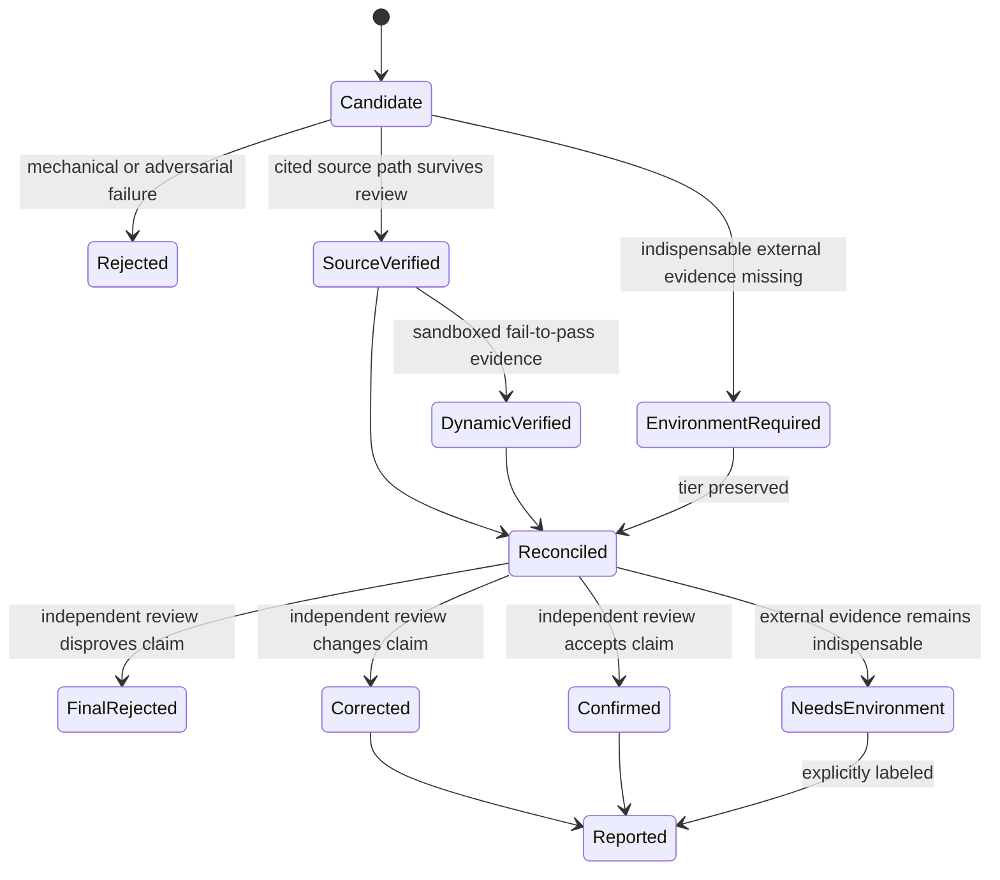

# VulnOps

VulnOps is an evidence-driven security audit architecture for source
repositories operating in restricted and air-gapped environments. It combines
deterministic scanners, bounded specialist agents, scoped AST graph analysis,
strict artifact contracts, independent verification, and deterministic report
generation.

The system is designed around one rule: hypotheses may be preserved, enriched,
and revisited, but they do not become reportable findings until they pass the
required evidence gates.

## Architecture

```mermaid
flowchart LR
    Operator["Operator"] --> Entry["run.sh"]
    Config["config.toml"] --> Entry
    Entry --> Main["OMP main controller"]

    Target["target/repo\nread-only"] --> Acquisition["Recon + deterministic evidence"]
    Main --> Acquisition
    Acquisition --> SCA["SCA"]
    Acquisition --> Secrets["Secrets"]
    SCA --> SAST["Threat model + bounded SAST"]
    Secrets --> SAST
    SAST --> Intelligence["Intelligence fusion"]
    Intelligence --> Triage["Triage"]
    Triage --> Intrusion["Scoped AST intrusion analysis"]
    Intrusion --> Reconcile["Reconciliation"]
    Reconcile --> Verify["Independent final verification"]

    Verify --> Authority["final-verification/findings.json"]
    Authority --> Renderer["Deterministic report renderer"]
    Renderer --> Reports["JSON + Markdown reports"]

    Acquisition --> Artifacts["Isolated run artifacts"]
    SAST --> Artifacts
    Intelligence --> Artifacts
    Intrusion --> Artifacts
    Artifacts --> Gates["Phase and whole-scan validators"]
    Authority --> Gates
    Reports --> Gates
    Gates --> Complete["Terminal validated run"]
```



OMP is the control plane. It schedules named phase agents, receives their
terminal yields, and advances the run only after deterministic validation.
Filesystem artifacts are the data plane and the source of truth; agent prose
and task summaries are not authoritative.

### Design invariants

| Invariant | Enforcement |
|---|---|
| Target source is immutable | `target/` is read-only during audit runtime; the final gate recomputes its working-tree fingerprint |
| Runs are isolated | Every audit writes to `scans/<repo-id>/runs/<run-id>/` |
| Runtime is offline | Only the configured LLM endpoint is permitted; scanners and graph analysis use local data |
| Work is bounded | Depth-specific task, concurrency, gapfill-round, and retry caps constrain fanout |
| Tool ownership is explicit | SCA owns dependency enumeration; Secrets owns secret enumeration; SAST consumes both without repeating them |
| Claims are evidence-backed | Schemas and semantic validators enforce paths, lines, traces, prerequisites, provenance, and verification state |
| Verification is layered | Source validation, optional dynamic proof, reconciliation, and fresh-context final verification are distinct gates |
| Reports are derived | Reports are rendered deterministically from canonical final findings and cannot introduce new claims |
| Secrets and proof tokens stay local | Secret values are fully redacted; reports omit exact proof inputs and raw runtime output |

## Control and evidence flow

The main controller executes the following phase graph:

1. **Run initialization** — detect the target, fingerprint the exact working
   tree, create an isolated run, and initialize lifecycle state.
2. **Reconnaissance** — three parallel perspectives map architecture, trust
   boundaries, actors, inputs, and security-relevant files into strict context
   artifacts.
3. **Deterministic collection** — SCA and secret discovery run in parallel and
   retain normalized, redacted evidence.
4. **Threat-oriented SAST** — build a repository-specific threat model and a
   subsystem × attack-class hunt matrix. Hunters execute bounded tasks with
   assigned doctrine and specialist lenses.
5. **Coverage and verification** — mechanically validate candidates,
   deduplicate by structured root cause, fill high-risk gaps, and adversarially
   verify surviving traces. Rejected preferred traces can advance to a distinct
   alternate without rechecking a root cause that already survived.
6. **Optional safe reproduction** — when explicitly enabled, demonstrate a
   narrow unpatched failure and patched pass inside an offline disposable
   sandbox. Retain sanitized tests, draft patches, hashes, and outcomes locally.
7. **Intelligence fusion** — preserve cross-tool observations, hypotheses,
   attack surfaces, graph scopes, coverage gaps, and future rule gaps.
8. **Triage and intrusion analysis** — normalize evidence-backed candidates and
   run scoped codegraph AST analysis for reachability and blast-radius questions.
9. **Reconciliation and independent verification** — apply only cited
   upgrades or downgrades, then independently re-read every factual claim in a
   fresh context.
10. **Rendering and final validation** — render sanitized reports from the
    canonical findings file and verify lifecycle state, provenance, counts,
    graph evidence, reproduction hashes, redaction, and the unchanged target.

### Phase contracts

| Phase | Primary contract | Downstream value |
|---|---|---|
| Recon | `repo-context/repo-context.json`, `security-surfaces.json`, `research/*.json` | Repository topology, actors, boundaries, entrypoints, exclusions |
| SCA | `sca/raw-advisories.json` | Local advisory evidence tied to installed versions and lockfiles |
| Secrets | `secrets/redacted-candidates.json` | Fully redacted secret locations and classification |
| SAST | `sast/threat-model.json`, `hunt-plan.json`, `coverage-ledger.json`, verified/dropped findings | Attack-class coverage, cited code paths, closure decisions |
| Intelligence | `intelligence/evidence-corpus.json`, attack map, cards, coverage/rule gaps | Cross-phase memory and scoped investigation plans |
| Intrusion | `intrusion/intrusion-plan.json`, scoped graph contexts, `enrichment.json` | Reachability, dependency impact, and blast-radius evidence |
| Reconciliation | `final-reconciliation/candidates.json` | Strict candidates ready for independent review |
| Final verification | `final-verification/findings.json` | Canonical confirmed, environment-required, corrected, and rejected outcomes |
| Report | `report/security-report.json`, `security-report.md` | Sanitized machine and human presentation |

### Finding lifecycle



Code candidates require a real attacker, a crossed trust boundary, intended
behavior, a structured root-cause location, an ordered entrypoint-to-sink
trace, typed conditions, mitigation review, concrete impact, and resolvable
provenance. Dependency and secret findings use dedicated source-specific
evidence instead of fabricated code traces.

## Run isolation and lifecycle state

Each run records repository identity, commit, configured depth and model,
target fingerprint, reproduction mode, phase state, and top-level task state:

```text
scans/<repo-id>/runs/<run-id>/
├── run-manifest.json
├── task-ledger.json
├── repo-context/
├── sca/
├── secrets/
├── sast/
├── intelligence/
├── triage/
├── intrusion/
├── final-reconciliation/
├── final-verification/
└── report/
```

Only the current incomplete run may resume, and only when repository, commit,
depth, target fingerprint, and reproduction mode still match. Completed and
failed runs remain historical deliverables and are never consumed as input by
a later audit.

The canonical finding authority is:

```text
final-verification/findings.json
```

Markdown is presentation. JSON controls finding state, metrics, severity,
verification tier, and provenance.

## Safety architecture

The normal audit is source-only. Target code execution is disabled unless
`harness.reproduction.mode` is explicitly set to `safe`.

Safe reproduction has no unsandboxed fallback. Its wrapper:

- verifies the target fingerprint before and after snapshot preparation;
- copies source into a disposable workspace without `.git`;
- presents only a minimal read-only runtime filesystem;
- hides the target checkout, home directories, and host configuration;
- removes inherited credentials and environment state;
- isolates the network and process namespace;
- applies time, CPU, memory, process, and output limits;
- redacts command output;
- retains a sanitized result plus local regression-test and draft-patch artifacts.

If the sandbox, build dependency, or required environment is unavailable, the
result becomes `environment_required`. The harness does not fall back to direct
execution.

For the deeper design rationale and extension map, see
[ARCHITECTURE.md](ARCHITECTURE.md). The executable orchestration contract lives
in [AGENTS.md](AGENTS.md).

---

## Operating the harness

### Requirements

| Requirement | Purpose |
|---|---|
| Bash-compatible shell environment | Harness scripts and OMP orchestration |
| Python 3.11+ | Configuration parsing, schemas, validators, and deterministic builders |
| Git | Target metadata and working-tree fingerprinting |
| OpenAI-compatible or supported OMP model endpoint | Main controller and specialist reasoning |

Harness-managed tools are installed into `bins/`. Audit runtime must not rely
on unrelated global scanner installations.

The deterministic builders and validators run on the system `python3` with
the standard library; audit runtime does not require a Python virtual
environment.

### Initial setup

```bash
cp config.toml.example config.toml
vi config.toml

bash scripts/install-tools.sh
bash scripts/fetch-osv-db.sh
bash scripts/bootstrap-omp.sh
bash scripts/validate-config.sh
```

Bootstrap operations such as tool installation, OSV database download, model
configuration, and target cloning happen before audit runtime.

### Configuration

`config.toml` is the configuration source of truth. The example uses one model
selector for every OMP role and defaults to a balanced audit:

```toml
[llm]
selector = "openai-codex/gpt-5.5:xhigh"
model = "gpt-5.5:xhigh"

[harness]
default_depth = "balanced" # quick | balanced | full

[harness.reproduction]
mode = "off"               # off | safe
sandbox = "auto"           # auto | bubblewrap
timeout_seconds = 120
cpu_seconds = 60
memory_mb = 1024
max_processes = 64
max_output_kb = 256
max_parallel = 1
```

For a custom OpenAI-compatible endpoint, configure `llm.base_url`,
`llm.api_key`, provider metadata, and a matching selector in `config.toml`.

Inspect the exported runtime environment and validate readiness with:

```bash
bash scripts/load-config.sh
bash scripts/validate-config.sh
```

The readiness gate checks configuration, model roles, OMP bootstrap state,
required binaries, the local OSV database, skills, agents, schemas, containment,
and safe-sandbox availability when reproduction is enabled.

### Prepare a target

Place exactly one Git repository under `target/`:

```bash
mkdir -p target
git clone https://github.com/org/repo.git target/repo
```

Alternatively:

```bash
bash scripts/clone-target.sh <repo_url> [branch] [clone_dir]
```

Target cloning and dependency setup are bootstrap operations, not audit-runtime
activities.

### Run an audit

Start OMP with the project controller:

```bash
bash run.sh "audit the target repo"
```

The configured default depth is used unless the operator requests `quick`,
`balanced`, or `full` explicitly.

| Depth | Hunt concurrency | Verification concurrency | Hunt-task cap | Gapfill rounds |
|---|---:|---:|---:|---:|
| `quick` | 4 | 4 | 12 | 1 |
| `balanced` | 8 | 8 | 32 | 2 |
| `full` | 16 | 12 | 64 | 3 |

Check status without restarting or resuming phase work:

```bash
bash scripts/audit-status.sh
```

### Validate a run

Validate one phase checkpoint:

```bash
bash scripts/validate-phase.sh <scan-base> <phase>
```

Validate the complete run:

```bash
bash scripts/validate-scan.sh scans/<repo-id>/runs/<run-id>
```

A validation failure is a terminal result until its stated artifact or
invariant is corrected. The harness does not report a failed scan as complete.

### Primary outputs

| Path | Purpose |
|---|---|
| `final-verification/findings.json` | Canonical independently verified finding set |
| `report/security-report.json` | Sanitized machine-readable report and metrics |
| `report/security-report.md` | Sanitized human-readable report |
| `final-reconciliation/candidates.json` | Strict candidates awaiting independent verification |
| `triage/findings.json` | Normalized, deduplicated candidates before intrusion analysis |
| `sast/coverage-ledger.json` | Area × attack-class coverage and funnel state |
| `sast/dropped-findings.json` | Mechanical, adversarial, dedup, and closure decisions |
| `intelligence/` | Evidence corpus, attack map, investigation cards, and open gaps |
| `intrusion/` | Scoped graph plans, contexts, and enrichment |
| `sast/`, `sca/`, `secrets/` | Phase evidence, provenance, summaries, and manifests |
| `sast/reproduction/` | Optional local tests, draft patches, hashes, and proof outcomes |
| `run-manifest.json`, `task-ledger.json` | Run identity, resumability, phase state, and task state |

## Offline and air-gapped deployment

Build the offline pack on the same platform as the offline target:

```bash
# Linux AMD64
bash scripts/offline-pack.sh --platform linux_amd64

# Apple Silicon macOS
bash scripts/offline-pack.sh --platform darwin_arm64
```

The build produces:

| Artifact | Git policy |
|---|---|
| `vulnops-offline-<platform>-<timestamp>.tar.gz` | Ignored; do not commit |
| `offline/vulnops-offline-<platform>-<timestamp>.tar.gz.part-*` | Commit for Git transport |
| `offline/offline-pack-chunks.json` | Commit with the chunks for auditability |
| `offline/offline-pack-chunks.sh` | Commit with the chunks; `offline-build.sh` consumes it without Python |

Commit the transportable chunk set:

```bash
git add offline/ offline-build.sh
git commit -m "Update offline pack chunks"
```

On the offline system, reconstruct and extract the pack:

```bash
bash offline-build.sh

mkdir -p /opt/vulnops
tar -xzf vulnops-offline-*.tar.gz -C /opt/vulnops
cd /opt/vulnops
vi config.toml
bash setup.sh
```

`offline-build.sh` verifies each chunk and the reconstructed archive SHA256
before writing the final tarball. It does not require Python for current chunk
sets.

By default, `scripts/offline-pack.sh` excludes the live `config.toml` and
packages `config.toml.example` as `config.toml`. Use `--include-config` only
when intentionally packaging live credentials.

The pack contains harness source, required binaries, and the local OSV
database. It does not bundle a model runtime, Python wheels, or CPython. Before
`setup.sh` can succeed, `config.toml` must select a model available to the
offline environment or point to a reachable local/LAN compatible endpoint.

Each offline pack build replaces the previous chunk set under `offline/`.

## Script reference

| Script | Responsibility |
|---|---|
| `run.sh [prompt]` | Validate runtime and launch the OMP main controller |
| `scripts/install-tools.sh` | Install harness-managed binaries into `bins/` |
| `scripts/fetch-osv-db.sh` | Fetch the local advisory database before offline runtime |
| `scripts/clone-target.sh <url> [branch] [dir]` | Optional pre-runtime target clone helper |
| `scripts/bootstrap-omp.sh` | Generate harness-local OMP model configuration |
| `scripts/run-audit.sh [depth]` | Detect, fingerprint, and initialize an isolated run |
| `scripts/update-run-state.py` | Atomically synchronize run, phase, and task lifecycle state |
| `scripts/build-hunt-plan.py` | Build and gap-fill the bounded hunt matrix |
| `scripts/finalize-sast.py` | Validate, deduplicate, advance alternates, and finalize SAST |
| `scripts/run-safe-reproduction.sh` | Execute opt-in proof inside the offline sandbox |
| `scripts/build-intelligence.py` | Build and finalize deterministic intelligence artifacts |
| `scripts/setup-codegraph.sh` | Initialize the per-audit codegraph index during run setup |
| `scripts/run-codegraph.sh` | Execute the required scoped AST graph backend |
| `scripts/codegraph-context.sh` | Materialize one scope's graph evidence context |
| `scripts/finalize-verification.py` | Produce canonical independently verified findings |
| `scripts/render-report.py` | Render sanitized JSON and Markdown reports |
| `scripts/audit-status.sh [scan_base]` | Report current scan state without mutation |
| `scripts/validate-config.sh` | Validate runtime readiness |
| `scripts/validate-phase.sh <scan_base> <phase>` | Validate a phase contract |
| `scripts/validate-scan.sh <scan_base>` | Validate whole-run integrity |
| `scripts/offline-pack.sh [options]` | Build an offline archive and Git-friendly chunks |
| `offline-build.sh [--force]` | Reconstruct an archive from committed chunks |
| `scripts/cleanup.sh [all|target|work|logs]` | Remove selected ephemeral state |

## Repository layout

```text
vulnops/
├── .omp/                  # Main controller prompt, phase agents, and audit skills
├── AGENTS.md              # Executable orchestration and phase contract
├── ARCHITECTURE.md        # Detailed design rationale and extension map
├── config.toml.example    # Configuration template
├── config/                # Agent prompts, taxonomy, locks, and compatibility config
├── schemas/               # Legacy and strict v2 artifact schemas
├── scripts/               # Runtime, planning, finalization, and validation tools
├── bins/                  # Harness-managed binaries
├── target/                # One read-only target repository
├── scans/                 # Immutable per-run audit deliverables
├── offline/               # Committable offline-pack chunks
└── .harness/              # Runtime home, caches, temporary work, logs, and generated OMP state
```

## Cleanup

```bash
bash scripts/cleanup.sh all
bash scripts/cleanup.sh target
bash scripts/cleanup.sh work
bash scripts/cleanup.sh logs
bash scripts/cleanup.sh --full
```

`all` preserves scan deliverables. Use `--full` only when intentionally
removing `scans/`.
